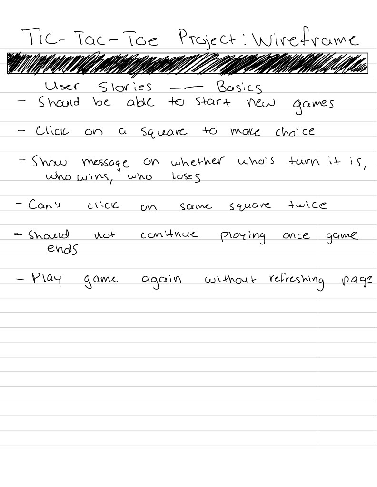
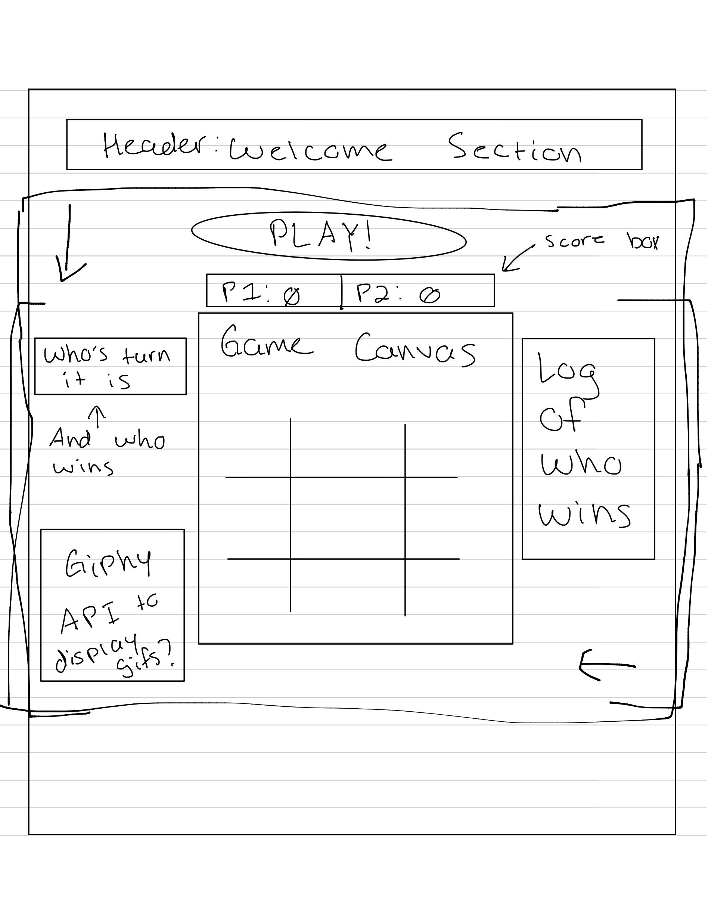
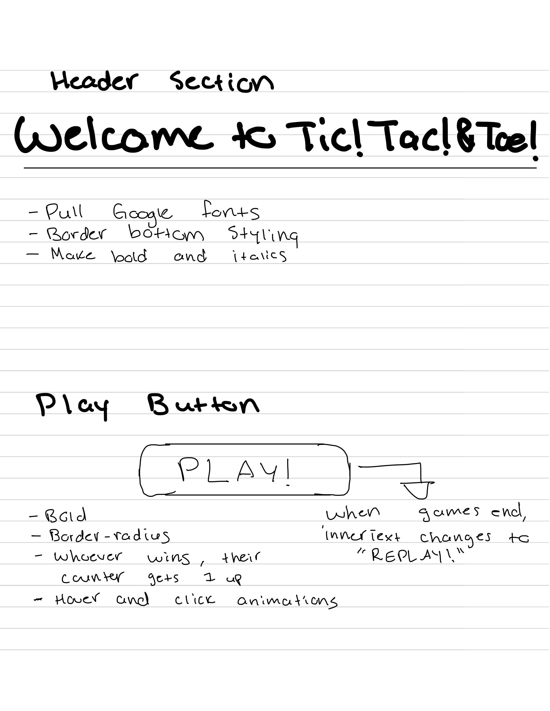
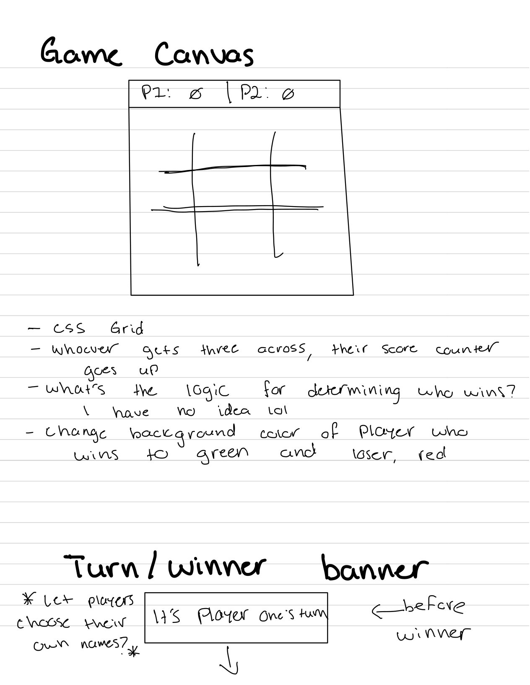
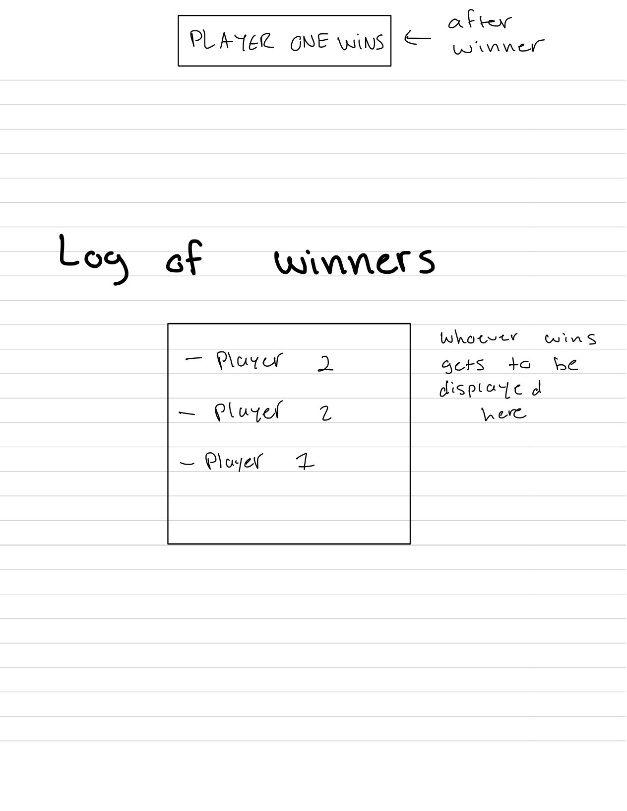
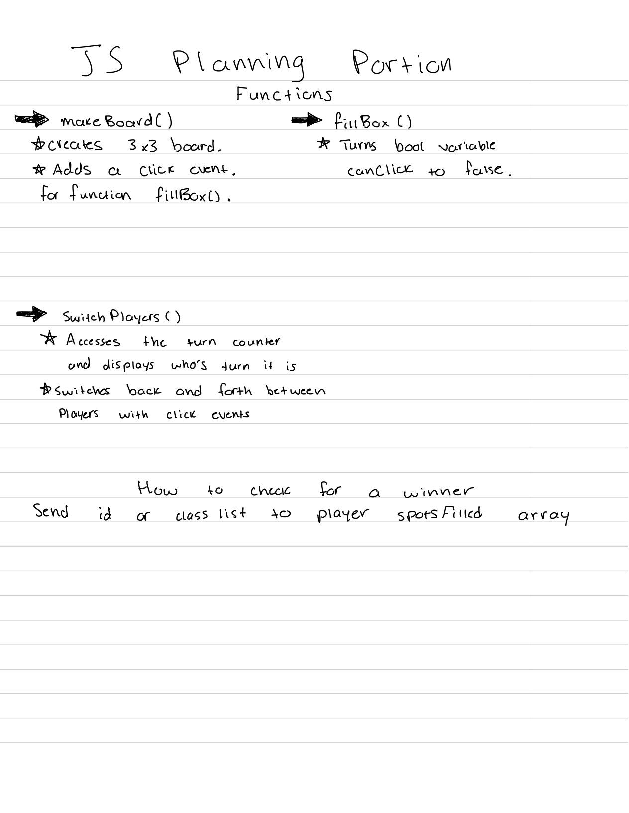

# *TIC-TAC-TOE Project*
Developer: Edgar Zambrana

Purpose: Create our own Tic-Tac-Toe game using HTML, CSS, and JavaScript and making it acessible to other with the use of GitHub Pages.
 

---
## Planning
I began my planning for the game on an app on my iPad called GoodNotes. That's where I was able to set up my wireframe and get a general idea of what it is I would be developing. I like to use a more handwritten approach because it really makes my head slow down and really think what it is that I'm planing out. Since I'm restricted by the time it takes me to write out my full idea on GoodNotes, I get to really think about if what I'm planning works or if I need to implement some changes once i start my code session.

---
## Approach
My approach to building this game was to write the HTML structure first and then style the minimum amount needed in order for it to look like a game. I feel very comfortable with HTML and CSS so I wanted to get what I thought easiest out of the way first. 

I knew that JavaScript was going to be the much tougher part for me so I wanted more time available to me in order to really press out my understanding of JavaScript.

After having an idea of what I wanted my JavaScript code to look like, I decided to mentally think of ways to make my code look better which was to use comments frequently to categorize blocks and code and I kept the idea of writing code so that it would be easier for somebody else to read it.

---
## Problems Encountered
This project was no walk in the park for me. I felt that my knowledge of HTML and CSS were pretty sharp at the time so I wanted to make this project use as much JavaScript as possible so that I can solidify my knowledge and what I have been taught with my time in the SEI. Even though I felt that I have a good understanding of OOP and JavaScript, I knew that an area I needed to work on is my algorithm thought process and how to make the code fit like puzzle pieces. A good example is this: Let's say I'm driving from Florida to Georgia. I know I need to take either Interstate 95 or Interstate 75, but I don't know the smaller streets needed to get on to the interstates and to get off. When it comes to actually practicing my code, I know HOW it would work, but I didn't know where to put certain variables in the correct position to manipulate a desired result. 

### Main Issues
* The biggest issue I had with this project was the game logic. I was having a really hard time testing out different solutions to have the game work properly but I just could not get it to work properly without having some kind of bugs or the application breaking on me.

* Some smaller issues I was having was establishing click events in the correct places, passing over the correct information to other functions, and making the board. Making the board was difficult because since it was made using JavaScript I thought I was limited in functionality but in reality I was opening up doors for more possibilities. The only question was: "How do I do it?"

* To piggy-back off of the previous issue, once I was able to make the board I then needed it to be able to reset itself so that the next games could start. I simply could not figure out how to remove the JavaScript made game board and replace it with a fresh one. i tried all different "remove" and "delete" functions but it wasn't working out for me.

---
## Solutions
The solutions I came across were from a lot of trial and error, planning, thinking, and brute force. Because of this, I learned some really valuable problem solving skills and how to break the problems down the very bottom layer and build from the ground up.
### Main Solutions
* When it came to figuring out the game logic I really had my work cut out for me. That was the longest portion for me because I tried to rush the solution instead of thinking about how I would set up the code blocks needed to have the functionality work.

* The click events were not much of a challenge with placing them in their proper spots in the JavaScript file, it was making sure that the targets being clicked were clicked only once and this piece of code was able to help me out. 

``
btnExample.addEventListener("click", funcExample, {once: true});
``

* To reset the board was another hard challenge because I tried every solution I thought would work to face the reality that it doesn't work. After stepping away over the weekend and thinking about why my solution doesn't work, I then remembered the concept of scope. When I remembered the concept of global and local scope I was able to clearly see which DOM variables I needed to declare and which JavaScript methods to use to delete the previous board and make a new one.

---

## Technologies Used
* ***Git & GitHub***: Version control and internet real estate
* ***Google Chrome***: View the code live and see the product
* ***Chrome Developer Tools***: Debugging and HTML/CSS structuring
* ***Visual Studio Code***: IDE of choice
* ***HTML & CSS***: Design game structure and give styling
* ***JavaScript***: Give the game interactivity and logic to work properly

---
## Reflection
In the end I gained some pretty good knowledge and understanding of not just JavaScript, but of programming in general.

I also had a "grow up" moment when I realized that I am indeed a professional and will be working amongst professionals so I need to treat myself, my code, and my designs as such. 